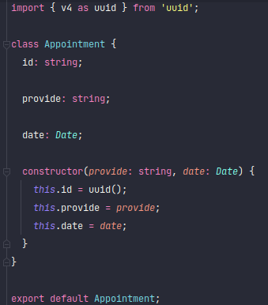
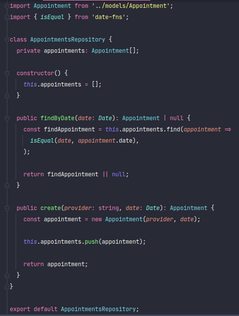
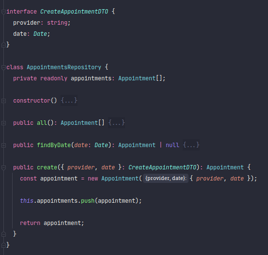
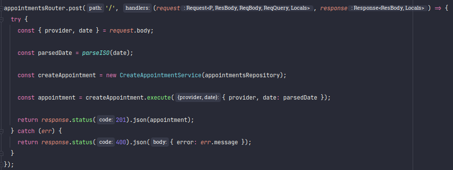
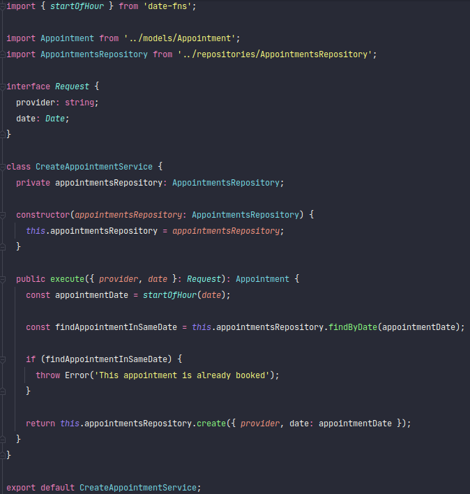

<h1 align="center">Api Node.js com TypeScript do GoBarber</h1>

<h2>Tecnologias</h2>

- [Express](https://expressjs.com/)
- [TypeScript](https://www.typescriptlang.org/)
- [date-fns](https://date-fns.org/)
- [TypeORM](https://typeorm.io/)
- [docker](https://www.docker.com/)
- [JWT](https://jwt.io/)

## Docker

### Postgres

```
docker run --name gobarber_db -e POSTGRES_PASSWORD=docker -e POSTGRES_USER=docker -p 5432:5432 -d postgres
```

## Metodologia

### DDD

[Domain-Driven Design](https://medium.com/spotlight-on-javascript/domain-driven-design-for-javascript-developers-9fc3f681931a)


## Estrutura

### Modelos

Representa a estrutura dos dados.



---

### Repositórios

É a conexão entre a persistência de dados e as rotas.



---

### DTO

Data Transfer Object (**DTO**) ou simplesmente Transfer Object é um padrão de projetos bastante usado para o transporte
de dados entre diferentes componentes de um sistema, diferentes instâncias ou processos de um sistema distribuído ou
diferentes sistemas via serialização.



---

### Rotas

Deve receber uma requisição, chama outro arquivo e devolver uma resposta.



---

### Services

- Lidando com regras de negócios;
- Em geral, eles só possuem um método público para executar uma tarefa;
- Não tem acesso ao `request` e `response` das rotas;
- **Dependency Inversion**: Quando precisar usar dependências externas, em vez de criar uma nova instância, ela deve ser
  passada como um parâmetro do construtor de serviço.


  
